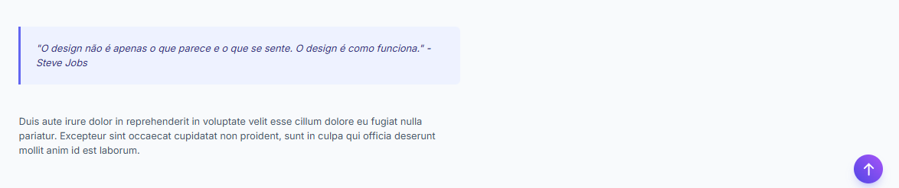

# ⬆️ Smart Scroll-to-Top - UX Interaction Showcase

Este projeto é uma implementação de um padrão de navegação essencial: o botão "Voltar ao Topo". O objetivo foi transformar um recurso funcional básico em uma experiência fluida e estética, simulando um ambiente de blog real para demonstrar a aplicação prática.

## 🎨 Design & UX Decisions

O projeto foi refinado com foco na continuidade da leitura e sutileza visual:

### 1. Contextualização (Storytelling)

Em vez de uma página em branco, o componente foi inserido em um **Layout de Artigo de Blog**. Isso demonstra o botão em seu habitat natural, onde a rolagem vertical é extensa e a necessidade de navegação rápida é real.

### 2. Comportamento "Fantasma" (Progressive Disclosure)

O botão respeita a regra de **Divulgação Progressiva**:
- **Estado Inicial:** Invisível e inativo (para não distrair a leitura inicial).
- **Gatilho:** Só aparece após o usuário rolar 300px, momento em que a intenção de retorno se torna provável.
- **Segurança:** Uso de `pointer-events-none` enquanto invisível para evitar cliques acidentais em áreas transparentes.

### 3. Animação de Entrada (Motion Design)

Diferente do padrão `display: none` (que faz o botão piscar na tela), utilizamos transições de CSS:
- **Slide Up:** O botão desliza suavemente de baixo para cima (`translate-y`).
- **Fade In:** A opacidade vai de 0 a 100% simultaneamente.

### 4. Estética Visual

- **Gradiente Moderno:** Indigo para Roxo (`bg-gradient-to-tr`), criando destaque sem ser agressivo.
- **Feedback Tátil:** Ao passar o mouse, o botão flutua (`-translate-y-1`) e aumenta a sombra, convidando ao clique.
- **Iconografia:** Uso de SVG inline para garantir nitidez em qualquer resolução de tela (Retina ready).

## 🛠️ Tecnologias Utilizadas

- **HTML5 Semântico** (`main`, `article`, `header`).
- **Tailwind CSS** (via CDN):
  - Utilitários de animação (`transition`, `duration`, `ease-out`).
  - Gradientes e Sombras (`shadow-lg`, `shadow-indigo-500/30`).
  - Tipografia (`prose-slate`).
- **JavaScript (Vanilla)**:
  - Event Listener de Scroll otimizado.
  - API `window.scrollTo` com comportamento `smooth` nativo.

## 🚀 Como Executar

O projeto é "Zero Config". Não requer instalação:

1. Baixe o arquivo `index.html`.
2. Abra diretamente no navegador.
3. Role a página para ver a interação.

## 🧩 Detalhes da Lógica

O script gerencia estados de classe CSS para garantir performance:

```javascript
// Exemplo da lógica de transição
if (window.scrollY > 300) {
    // Remove o "esconderijo" e traz o botão para a tela
    btn.classList.remove('translate-y-10', 'opacity-0'); 
}
```

## 📂 Estrutura de Arquivos
/

    └── index.html       # Contém HTML, CSS (Tailwind) e JS
    └── README.md        # Documentação do projeto
    └── img/
    └── img.png  # Screenshot do componente